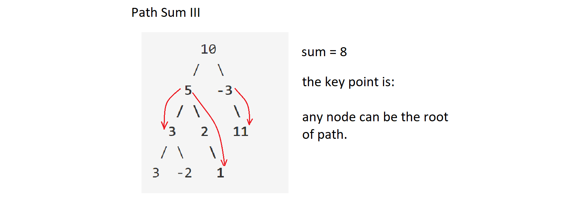
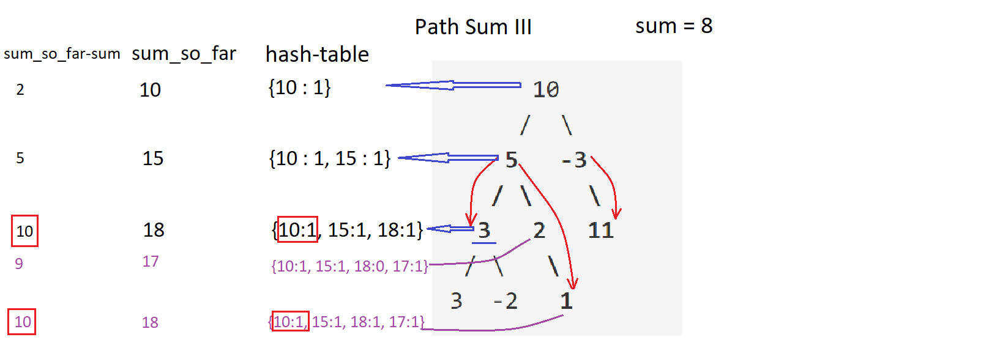

# [112. Path Sum](https://leetcode.com/problems/path-sum/description/)  -  Easy
## Problem Description
Given a binary tree and a sum, determine if the tree has a _**root-to-leaf path**_ such that adding up all the values along the path equals the given sum.

For example:
Given the below binary tree and sum = 22,
```
              5
             / \
            4   8
           /   / \
          11  13  4
         /  \      \
        7    2      1
```        
return true, as there exist a root-to-leaf path 5->4->11->2 which sum is 22.

## Solution
```
/**
 * Definition for a binary tree node.
 * function TreeNode(val) {
 *     this.val = val;
 *     this.left = this.right = null;
 * }
 */
/**
 * @param {TreeNode} root
 * @param {number} sum
 * @return {boolean}
 */
 var hasPathSum = function(root, sum) {
    var result = false;
    
    function findPath(node, sum) {
        if (!node)   return;
        
        sum -= node.val;
        if (!node.left && !node.right && sum === 0) {
            result = true;
            return;
        }
                
        findPath(node.left, sum);
        findPath(node.right, sum);
    }
    
    findPath(root, sum);
    return result;
};
```

# [437. Path Sum III](https://leetcode.com/problems/path-sum-iii/description/)  -  Easy
## Problem Description
You are given a binary tree in which each node contains an integer value.

Find the number of paths that sum to a given value.

_**The path does not need to start or end at the root or a leaf, but it must go downwards (traveling only from parent nodes to child nodes).**_

The tree has no more than 1,000 nodes and the values are in the range -1,000,000 to 1,000,000.

Example:
```
root = [10,5,-3,3,2,null,11,3,-2,null,1], sum = 8

      10
     /  \
    5   -3
   / \    \
  3   2   11
 / \   \
3  -2   1

Return 3. The paths that sum to 8 are:

1.  5 -> 3
2.  5 -> 2 -> 1
3. -3 -> 11
```

## Solution


Base on problem 112's idea, we need to add one more recursion for starting path from any node. The total sum equals to : the path num start from current node + path sum start from left of current node + path sum start from right of current node.
```
/**
 * Definition for a binary tree node.
 * function TreeNode(val) {
 *     this.val = val;
 *     this.left = this.right = null;
 * }
 */
/**
 * @param {TreeNode} root
 * @param {number} sum
 * @return {number}
 */
var pathSum = function(root, sum) {
    if (!root)   return 0;
    
    function findPath(node, val) {
        if (!node)   return 0;
        return (node.val === val) + findPath(node.left, val - node.val) + findPath(node.right, val - node.val);
    }
    
    return findPath(root, sum) + pathSum(root.left, sum) + pathSum(root.right, sum);
};

```

### [Optimization](https://discuss.leetcode.com/topic/65100/python-solution-with-detailed-explanation)
Use hashtable (extra space) get O(N) time complexity.
- As we traverse down the tree, at an arbitrary node N, we store the sum from root to this node N (sum_so_far = sum_so_far (prefix) + N.val) in hash-table as KEY, and VALUE++. Which means we found VALUE number of paths whose sum equal to KEY.
- For each node N, we check if (sum_so_far - sum) exist in hash-table, if yes, `result += hash[sum_so_far - sum]`. The reason is for example, if we have path `[a,b,c,d,e,f]`, if `Sum(a~f) - Sum(a~c) = target`, then path d->e->f sum equals to target. As we stored `Sum(a~c)` and `Sum(a~f)` in hash-table, so if `Sum(a~f) - target = Sum(a~c)` which also means path exist.
- After we are done with a node and all its grandchildren, we remove it from the hash-table. This makes sure that the number of complement paths returned always correspond to paths that ended at a predecessor node.

```
/**
 * Definition for a binary tree node.
 * function TreeNode(val) {
 *     this.val = val;
 *     this.left = this.right = null;
 * }
 */
/**
 * @param {TreeNode} root
 * @param {number} sum
 * @return {number}
 */
var pathSum = function(root, sum) {
    let map = {};
    map[0] = 1;
    return helper(root, 0, sum);
    
    function helper(root, curr, target) {
        if (!root) return 0;
        curr += root.val;
        let res = map[curr - target] || 0;
        map[curr] = (map[curr] || 0) + 1;
        
        res += helper(root.left, curr, target) + helper(root.right, curr, target);
        map[curr] = map[curr] - 1;
        return res;
    }
};
```

# [113. Path Sum II](https://leetcode.com/problems/path-sum-ii/description/)  -  Medium

# [64. Minimum Path Sum](https://leetcode.com/problems/minimum-path-sum/description/)   -   Medium

# [129. Sum Root to Leaf Numbers](https://leetcode.com/problems/sum-root-to-leaf-numbers/description/)  -  Medium

# [120. Triangle](https://leetcode.com/problems/triangle/description/)   -   Medium

# [666. Path Sum IV](https://leetcode.com/problems/path-sum-iv)  -  Medium, Locked

# [124. Binary Tree Maximum Path Sum](https://leetcode.com/problems/binary-tree-maximum-path-sum/description/)  -  Hard
